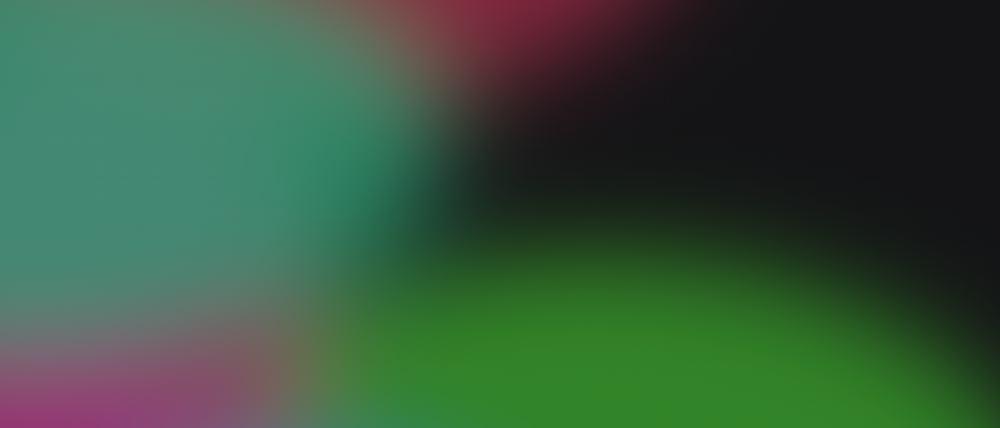

# Gradients

Gradientes suaves para qualquer tela.

**[Abrir o Gradients →](https://romastefale.github.io/gradients/)**

Cada toque gera um gradiente novo e único: manchas de cor que se misturam com delicadeza, no tema claro ou no escuro.

## O que você pode fazer

- **Gerar** um gradiente aleatório a qualquer momento
- **Escolher o formato:** 1:1, 16:9, 4:3, 3:2 ou 21:9, na horizontal ou na vertical
- **Alternar** entre tema claro e escuro
- **Baixar** o resultado em PNG, HTML ou CSS
- **Instalar** na tela inicial e usar como um aplicativo

Pensado para o celular, funciona bem também no computador.

## Para quê

Papéis de parede, fundos de apresentação, capas, planos de fundo para sites e o que mais você imaginar.
